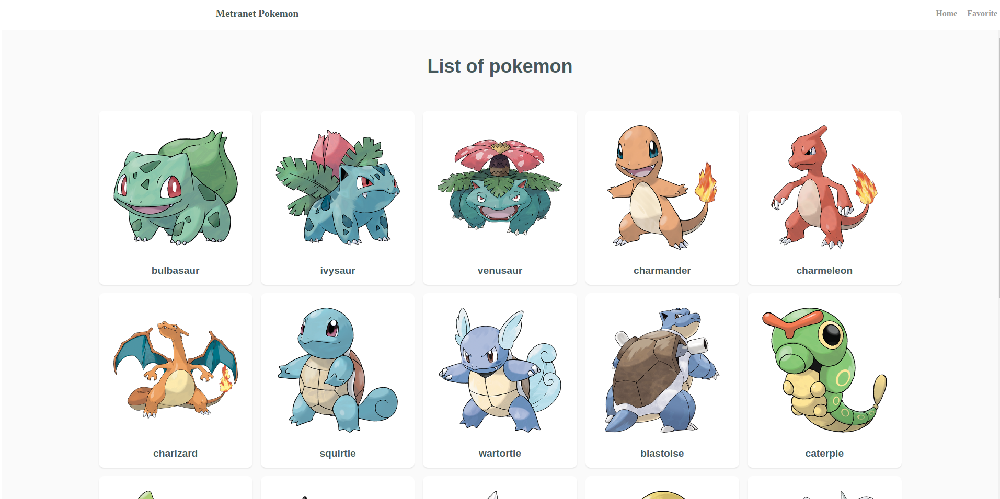
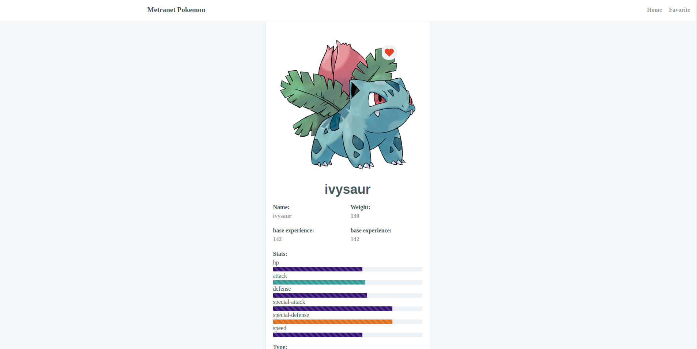
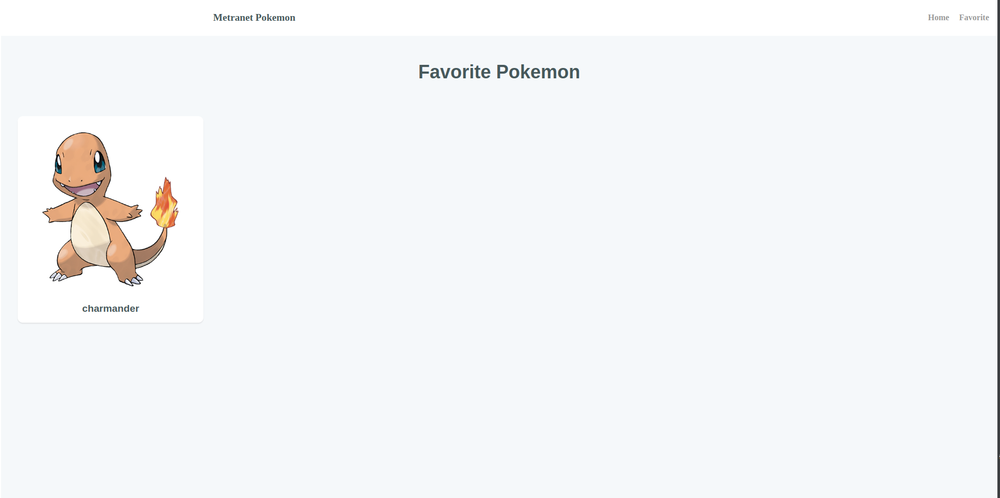

# Pokemon - Next.js Application

This is a Next.js application for searching and displaying books. It uses various technologies and libraries including Chakra UI, Redux Toolkit, React Query, and more. The application allows users to search for books, view details about them, and paginate through the results.


## Getting Started

To get started with this project, follow these steps:

1. Clone the repository:

   ```shell 
   git clone https://github.com/pranahonk/Nusameta-Pokemon

2. Navigate to the project directory:
    ```shell
    cd metranet-pokemon-api
    ```
3. Install the project dependencies using Yarn or npm:
    ```shell
    yarn
    # or
    npm install
   ```

4. Start the development server:
    ```shell
    yarn dev
    ```
   
## Usage
Once the development server is running, open your web browser and navigate to `http://localhost:3000` to access the application. You can start searching for books and using the filters immediately.




## API Reference
This project uses the Google Books API for retrieving book information. The API endpoint is:

```shell
   https://pokeapi.co/api/v2/pokemon/
```


## Deployment

to deploy this application, you can follow the deployment guidelines for Next.js applications. You may deploy it to platforms like Vercel, Netlify, or your own server.


## Built With
This project was built using the following libraries and technologies:

- [Chakra UI Icons](https://chakra-ui.com/icons): Icon library for Chakra UI.
- [Chakra UI](https://chakra-ui.com/): A simple, modular, and accessible component library for React.
- [Emotion](https://emotion.sh/): A performant and flexible CSS-in-JS library.
- [React Hook Form](https://react-hook-form.com/): A library for managing form state and validation in React.
- [Redux Toolkit](https://redux-toolkit.js.org/): A set of tools and best practices for Redux.
- [Axios](https://axios-http.com/): A promise-based HTTP client for the browser and Node.js.
- [Framer Motion](https://www.framer.com/motion/): A library for adding animations and transitions to React applications.
- [Next.js](https://nextjs.org/): A popular React framework for building server-rendered React applications.
- [PostCSS](https://postcss.org/): A tool for transforming CSS with JavaScript.
- [React](https://reactjs.org/): A JavaScript library for building user interfaces.
- [React Datepicker](https://reactdatepicker.com/): A simple and reusable datepicker component for React.
- [React Query](https://react-query.tanstack.com/): A library for fetching and caching data in React.
- [React Redux](https://react-redux.js.org/): Official React bindings for Redux.


## Contributing
If you'd like to contribute to this project, please create a pull request to the master branch.

## License
This project is licensed under the MIT License.
